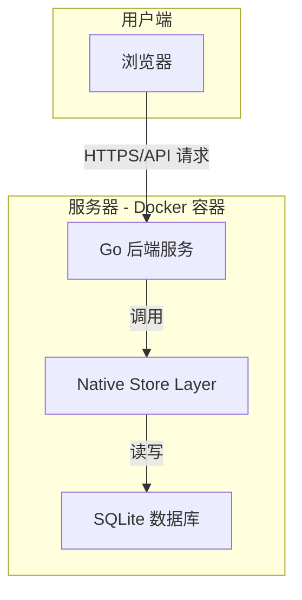

# Diarum 项目规划文档

---

## 1. 产品规划 (Product Requirements)

### 1.1. 项目愿景与定位

**项目名称**: Diarum

**愿景**: 打造一款极简、灵动且功能强大的开源自托管日记应用，深度聚焦个人日记的核心体验，并通过 AI 技术赋能，帮助用户更好地记录、回顾和理解自己的生活。

**核心定位**: 面向注重隐私、数据所有权和优质体验的个人日记爱好者与生活记录者。

**核心原则**:

- **极简专注**: 打开即写，默认展示今日编辑页面，无干扰。
- **深度回顾**: 提供多种时间维度的回顾方式，让日记"活"起来。
- **AI 智能**: 利用大语言模型（LLM）生成周期性报告，发掘数据价值。
- **隐私优先**: 完全自托管，数据 100% 由用户掌控。
- **性能卓越**: 追求快速、流畅、不卡顿的用户体验。
- **开放互联**: 提供稳定、可靠、文档完善的 API，鼓励第三方生态发展。

### 1.2. 核心功能规划 (Roadmap)

#### V1 - 最小可行产品 (MVP) ✅ 已实现

此阶段的目标是快速验证核心体验：**记录与回顾**。

| 模块 | 功能点 | 详细描述 |
| :--- | :--- | :--- |
| **用户系统** | 单用户认证 | 首次启动时设置用户名和密码，后续登录使用（`POST /api/v1/auth/register` / `login`）。 |
| **核心编辑** | 今日日记 + 自动保存 | 打开应用直接进入今日日记的富文本编辑器（`TiptapEditor.svelte`），修改时自动保存。 |
| **核心导航** | 前后一天 | 提供"前一天"和"后一天"的快速切换按钮。 |
| | 日历跳转 | 提供一个日历视图（`Calendar.svelte`），可以快速跳转到任意指定日期。 |
| **数据管理** | 基础搜索 | 支持对所有日记内容进行关键词全文检索（`/api/v1/diaries/search`）。 |
| **开放性** | 基础 API | 提供稳定的 CRUD API 用于日记条目（统一使用 `/api/v1/diaries` 前缀）。 |
| **部署** | 一键部署 | 应用打包为单一二进制文件，内置 SQLite 与前端静态资源；配合 `docker-compose.yml` 快速部署。 |

#### V2 - 核心功能完善 ⚠️ 部分实现

此阶段的目标是丰富日记的**组织维度**和**回顾方式**。

| 模块 | 功能点 | 详细描述 | 状态 |
| :--- | :--- | :--- | :--- |
| **高级导航** | 去年今日 | 在查看当日日记时，展示往年今日的内容。 | ❌ 未实现 |
| | 日记漫游 | 提供一个"随机漫游"按钮，随机跳转到过去的一篇日记。 | ❌ 未实现 |
| **组织方式** | 标签系统 | 支持为每篇日记打上多个标签，并提供按标签筛选日记的功能。 | ✅ 已实现（`tags` 页面 + `/api/v1/tags`） |
| **丰富维度** | 心情与天气 | 在日记中记录当天的心情和天气情况，并支持用户自定义预设。 | ✅ 已实现（`diary.mood_options` / `diary.weather_options`） |
| **编辑器** | 图片上传 | 支持在日记中上传图片，图片存储于本地媒体目录（可切换 S3 / Chevereto 图床）。 | ✅ 已实现（`/api/v1/upload`） |

#### V3 - AI 智能与高级功能 ⚠️ 部分实现

此阶段的目标是引入 **AI 能力**和**高级数据管理**，形成产品护城河。

| 模块 | 功能点 | 详细描述 | 状态 |
| :--- | :--- | :--- | :--- |
| **AI 助手** | 周期性报告 | 用户可配置自己的 LLM API Key，应用调用 API 生成周报、月报。 | ✅ 已实现（`/api/v1/ai/analysis`） |
| | AI 对话 + RAG | 用户可以和 AI 对话，AI 根据向量库检索相关日记内容并附带引用。 | ✅ 已实现（`/api/v1/ai/chat` + chromem-go 向量库） |
| | 向量库管理 | 支持手动/增量构建向量索引，查询构建状态。 | ✅ 已实现（`/api/v1/ai/vectors/*`） |
| | 对话历史 | 存储用户与 AI 的全部对话，可在前端浏览与回顾。 | ✅ 已实现（`ai_conversations` / `ai_messages`） |
| **高级管理** | 高级搜索 | 支持按日期范围、标签、心情、天气等多维度组合搜索。 | ⚠️ 部分实现（目前仅支持关键词搜索，标签筛选已在前端实现） |
| | 数据导出 | 支持将所有日记导出为 Markdown 文件压缩包或单个 JSON 文件。 | ✅ 已实现（`/api/v1/export/zip` 等） |
| **生态互联** | Webhooks | 当创建或更新日记时，可以触发 Webhook 通知到其他服务（此处特指 Memos 集成）。 | ✅ 已实现（Memos Webhook） |
| | 通用 Webhooks | 可自定义向任意外部服务发送通知。 | ❌ 未实现 |
| | Telegram Bot | 提供一个 Telegram Bot，允许用户通过聊天快速记录日记片段。 | ❌ 未实现 |
| | Chevereto 图床 | 将媒体文件上传到自建的 Chevereto 图床，使用户的图片独立于 Diarum 实例。 | ✅ 已实现（`/api/v1/chevereto/*`） |

#### 实现进度总览

| 大项 | 完成率 | 说明 |
| :--- | :--- | :--- |
| 核心 MVP（V1） | 100% | 今日日记、自动保存、日历、搜索、登录、CRUD API 均可用。 |
| 高级导航（V2） | 40% | 标签/心情/天气已实现；"去年今日"和"日记漫游"尚未实现。 |
| AI 与高级功能（V3） | 60% | AI 对话 + 向量 RAG、周期报告、Memos、Chevereto、导入导出均已实现。通用 Webhook、Telegram Bot 待实现。 |

### 1.3. 非功能性需求

- **性能**: 页面加载时间 < 1秒，API 响应时间 < 200ms。
- **安全**: 密码加密存储，API 需 Token 认证。
- **可维护性**: 代码结构清晰，有良好的注释和文档。
- **兼容性**: 优先保证 Chrome、Firefox、Safari 等现代浏览器的体验。

---

## 2. 技术设计 (Technical Design)

### 2.1. 架构设计

Diarum 将采用**单体应用 (Monolithic) 架构**，将 Go 后端、SQLite 数据库访问层与前端静态资源打包成一个独立的二进制文件。前端是一个独立的单页应用 (SPA)，通过 API 与后端通信。这种架构旨在实现极致的部署简洁性，符合自托管应用的核心理念。

#### 架构图



#### 请求流程

1.  用户通过浏览器访问 Diarum 的 Web 前端。
2.  前端静态资源（HTML/CSS/JS）由 Go 后端提供服务。
3.  前端应用通过 RESTful API 向 Go 后端发起数据请求（如获取、保存日记）。
4.  Go 后端接收到 API 请求，调用原生 store 层来执行相应的数据库操作。
5.  Store 层操作底层的 SQLite 数据库文件 (`diarum.db`) 和本地媒体目录。
6.  Go 后端将查询结果格式化为 JSON，返回给前端。

### 2.2. 技术栈选型

| 分层 | 技术 | 选型理由 |
| :--- | :--- | :--- |
| **后端** | **Go** | 高性能、静态编译、跨平台，适合构建单一二进制文件，简化部署。 |
| | **Native Go Store** | 提供数据库、用户认证、文件存储和 API 所需的数据访问能力，减少外部运行时依赖。 |
| | **Echo Web Framework** | 一个轻量级且高性能的 Go Web 框架，用于快速构建 RESTful API 路由（实际代码中替代了 Gin）。 |
| **前端** | **SvelteKit** | 一个现代、高性能的前端框架。其编译时优化的特性与项目的"极简、性能"理念高度契合。 |
| | **Tailwind CSS** | 提供原子化的 CSS 类，可以快速构建现代化且高度可定制的 UI，而无需编写大量自定义 CSS。 |
| | **Tiptap Editor** | 基于 ProseMirror 的所见即所得富文本编辑器，通过前端 `TiptapEditor.svelte` 组件集成（实际代码中替代了 Milkdown）。 |
| **数据库** | **SQLite** | 轻量、零配置、文件即数据库，完美契合自托管和单体应用的场景。由 Diarum 原生 store 层管理。 |
| **AI/向量** | **chromem-go + EmbeddingService** | 内存型向量数据库，用于 AI 对话检索和向量构建，支持任意兼容 OpenAI 格式的 LLM 和 Embedding 服务。 |
| **部署** | **Docker & Docker Compose** | 实现环境隔离和一键部署，是现代自托管应用的最佳实践。 |
| **CI/CD** | **GitHub Actions** | 自动化构建、测试和发布 Docker 镜像的流程。 |

### 2.3. 数据库设计 (SQLite Tables)

#### `users` 表

存储用户信息和认证凭据，由 Diarum 原生 store 层管理。

| 字段名 | 类型 | 描述 |
| :--- | :--- | :--- |
| `id` | `TEXT PRIMARY KEY` | 用户唯一 ID（由 `GenerateID()` 生成） |
| `username` | `TEXT NOT NULL UNIQUE` | 用户名（登录凭据之一） |
| `passwordHash` | `TEXT NOT NULL` | 密码哈希 |
| `tokenKey` | `TEXT NOT NULL UNIQUE` | 用于生成 JWT Token 的密钥 |
| `email` | `TEXT DEFAULT ''` | 电子邮件 |
| `name` | `TEXT DEFAULT ''` | 显示名称 |
| `avatar` | `TEXT DEFAULT ''` | 头像地址 |
| `verified` | `BOOLEAN DEFAULT FALSE` | 邮箱验证标记 |
| `created` / `updated` | `TEXT NOT NULL` | 创建/更新时间 |

#### `diaries` 表

存储核心的日记内容。

| 字段名 | 类型 | 描述 | 约束 |
| :--- | :--- | :--- | :--- |
| `id` | `TEXT PRIMARY KEY` | 日记唯一 ID |
| `date` | `TEXT NOT NULL` | 日记的日期（格式如 `2025-06-19 00:00:00.000Z`） | 参与复合唯一索引 |
| `content` | `TEXT NOT NULL` | 日记的正文内容（富文本 HTML/Markdown） | |
| `tags` | `JSON DEFAULT '[]'` | 日记的标签列表（JSON 数组） | |
| `mood` | `TEXT DEFAULT ''` | 当天的心情（可选，用户通过预设 emoji 选择） | |
| `weather` | `TEXT DEFAULT ''` | 当天的天气（可选） | |
| `owner` | `TEXT NOT NULL` | 日记的所属用户 | 外键关联 `users.id` |
| `created` / `updated` | `TEXT NOT NULL` | 创建/更新时间 | |

**索引**:
- `UNIQUE INDEX idx_diaries_date_owner ON diaries(date, owner)` - 确保每个用户每天只能有一篇日记。
- `INDEX idx_diaries_owner_date ON diaries(owner, date)` - 加速按用户、日期查询。

#### `tags` 表

用于管理标签的定义（去重元数据），标签的实际使用仍以 `diaries.tags` JSON 字段为准。

| 字段名 | 类型 | 描述 | 约束 |
| :--- | :--- | :--- | :--- |
| `id` | `TEXT PRIMARY KEY` | 标签唯一 ID | |
| `name` | `TEXT NOT NULL` | 标签的名称 | 参与复合唯一索引 |
| `owner` | `TEXT NOT NULL` | 标签的所属用户 | 参与复合唯一索引，外键关联 `users.id` |

**索引**: `UNIQUE INDEX idx_tags_name_owner ON tags(name, owner)` - 确保每个用户的标签名唯一。

#### `media` 表

用于存储用户上传的图片/媒体文件元数据。

| 字段名 | 类型 | 描述 | 约束 |
| :--- | :--- | :--- | :--- |
| `id` | `TEXT PRIMARY KEY` | 媒体唯一 ID | |
| `file` | `TEXT NOT NULL` | 文件名（用于拼接物理路径） | |
| `name` | `TEXT DEFAULT ''` | 原始文件名 | |
| `alt` | `TEXT DEFAULT ''` | 替代文本 | |
| `diary` | `JSON DEFAULT '[]'` | 关联的日记 ID 列表 | |
| `owner` | `TEXT NOT NULL` | 媒体的所属用户 | 外键关联 `users.id` |

**索引**: `INDEX idx_media_owner_created ON media(owner, created)` - 加速按用户、时间查询。

#### `user_settings` 表

**统一配置系统**的核心表，采用 Key-Value 模式存储用户的全部配置，支持加密存储敏感信息。由 `internal/config/registry.go` 中的 `ConfigRegistry` 定义元数据。

| 字段名 | 类型 | 描述 |
| :--- | :--- | :--- |
| `id` | `TEXT PRIMARY KEY` | 配置条目唯一 ID |
| `user` | `TEXT NOT NULL` | 配置的所属用户（外键关联 `users.id`） |
| `key` | `TEXT NOT NULL` | 配置键（如 `ai.api_key`、`chevereto.domain`） |
| `value` | `JSON` | 配置值（JSON 编码） |
| `encrypted` | `BOOLEAN DEFAULT FALSE` | 该配置是否加密存储 |
| `created` / `updated` | `TEXT NOT NULL` | 创建/更新时间 |

**核心配置键（部分）**:

| 键 | 类型 | 加密 | 用途 |
| :--- | :--- | :--- | :--- |
| `api.token` | `string` | 否 | 用户的 API Token，用于外部 API 访问 |
| `api.enabled` | `bool` | 否 | 是否启用外部 API 访问 |
| `ai.api_key` | `string` | **是** | LLM 服务的 API Key |
| `ai.base_url` | `string` | 否 | 自定义 LLM API 地址 |
| `ai.chat_model` | `string` | 否 | 对话模型名称 |
| `ai.embedding_model` | `string` | 否 | 向量模型名称 |
| `ai.vectors_built_at` | `string` | 否 | 最近一次向量构建时间 |
| `ai.analysis_system_prompt` / `ai.analysis_user_prefix` | `string` | 否 | AI 分析用的 Prompt 模板 |
| `chevereto.enabled` | `bool` | 否 | 是否启用 Chevereto 图床 |
| `chevereto.domain` | `string` | 否 | Chevereto 域名 |
| `chevereto.api_key` | `string` | **是** | Chevereto API Key |
| `chevereto.album_id` | `string` | 否 | Chevereto 相册 ID |
| `image_upload.provider` | `string` | 否 | 当前使用的图片存储方案（`local` / `s3` / `chevereto`） |
| `image_upload.local.path` | `string` | 否 | 本地存储目录 |
| `image_upload.s3.*` | 各类 | 是/否 | S3 兼容存储配置 |
| `diary.mood_options` | `JSON(string[])` | 否 | 用户可选的心情列表 |
| `diary.weather_options` | `JSON(string[])` | 否 | 用户可选的天气列表 |
| `memos.enabled` | `bool` | 否 | 是否启用 Memos 同步 |
| `memos.webhook_token` | `string` | **是** | Memos Webhook Token |
| `memos.base_url` | `string` | 否 | Memos 服务地址 |

#### `ai_conversations` 表

存储 AI 对话的会话元数据。

| 字段名 | 类型 | 描述 |
| :--- | :--- | :--- |
| `id` | `TEXT PRIMARY KEY` | 会话 ID |
| `title` | `TEXT NOT NULL` | 会话标题（可自动生成） |
| `owner` | `TEXT NOT NULL` | 所属用户 |
| `created` / `updated` | `TEXT NOT NULL` | 创建/更新时间 |

#### `ai_messages` 表

存储 AI 对话中的消息内容及引用的日记（用于 RAG 检索追溯）。

| 字段名 | 类型 | 描述 |
| :--- | :--- | :--- |
| `id` | `TEXT PRIMARY KEY` | 消息 ID |
| `conversation` | `TEXT NOT NULL` | 所属会话 ID |
| `role` | `TEXT NOT NULL` | `user` / `assistant` |
| `content` | `TEXT NOT NULL` | 消息正文 |
| `referenced_diaries` | `JSON` | 引用的日记 ID 列表（AI 回复时的检索来源） |
| `owner` | `TEXT NOT NULL` | 所属用户 |

#### `period_analyses` 表

存储 AI 周期分析报告（周报/月报等）。

| 字段名 | 类型 | 描述 |
| :--- | :--- | :--- |
| `id` | `TEXT PRIMARY KEY` | 分析报告 ID |
| `owner` | `TEXT NOT NULL` | 所属用户 |
| `period` | `TEXT NOT NULL` | 周期类型（`week` / `month` / `custom` 等） |
| `start_date` / `end_date` | `TEXT NOT NULL` | 分析的起止日期 |
| `keywords` | `TEXT DEFAULT ''` | 关键词过滤（支持根据关键词生成分析报告） |
| `diary_count` | `INTEGER DEFAULT 0` | 分析覆盖的日记数量 |
| `summary` | `TEXT NOT NULL` | AI 生成的摘要内容 |
| `system_prompt` / `user_prefix` | `TEXT NOT NULL` | 使用的 Prompt 模板 |

**索引**: `UNIQUE INDEX idx_period_analyses_owner_period ON period_analyses(owner, period, start_date, end_date, keywords)` - 同一周期+关键词只保留一份最新报告。

#### `schema_migrations` / `migration_meta` 表

由 Diarum 自动维护，用于追踪数据库 schema 版本和应用迁移元数据。

### 2.4. API 设计（已实现）

API 遵循 RESTful 风格，所有路由以 `/api/v1/` 为前缀，使用 **Echo** 框架实现，由 `authMiddleware` 控制访问（需登录/携带 API Token）。以下为实际已实现的主要 API。

#### 认证

| 方法 | 路径 | 描述 |
| :--- | :--- | :--- |
| `POST` | `/api/v1/auth/login` | 用户登录，返回 JWT Token（带 `tokenKey` 的签名）。 |
| `POST` | `/api/v1/auth/register` | 首次启动时注册用户（单用户模式）。 |
| `GET` | `/api/v1/auth/check` | 检查当前请求的 Token 是否有效（前端保持会话的常用方法）。 |
| `POST` | `/api/v1/auth/logout` | 用户登出（清除前端 Token）。 |

#### 日记

| 方法 | 路径 | 描述 |
| :--- | :--- | :--- |
| `GET` | `/api/v1/diaries/:date` | 获取指定日期的日记（支持 `YYYY-MM-DD` 格式）。 |
| `POST` | `/api/v1/diaries` | 创建或更新一篇日记（`date` 唯一）。 |
| `GET` | `/api/v1/diaries/search?q=<keyword>` | 关键词全文检索日记（LIKE 匹配 content 与 tags）。 |
| `GET` | `/api/v1/diaries/exists?dates=2023-01-01,2023-01-02` | 批量检查哪些日期存在日记（日历视图使用）。 |
| `GET` | `/api/v1/diaries?start=xxx&end=xxx&order=date|created` | 按时间范围、排序方式列出日记列表。 |
| `DELETE` | `/api/v1/diaries/:id` | 删除指定日记。 |

#### 标签

| 方法 | 路径 | 描述 |
| :--- | :--- | :--- |
| `GET` | `/api/v1/tags` | 获取用户所有标签（含各标签的日记数量，用于标签云）。 |
| `GET` | `/api/v1/tags/:name/diaries` | 获取指定标签下的所有日记列表。 |

#### 心情/天气

| 方法 | 路径 | 描述 |
| :--- | :--- | :--- |
| `GET` | `/api/v1/mood-options` | 获取当前用户预设的心情选项（`diary.mood_options`）。 |
| `GET` | `/api/v1/weather-options` | 获取当前用户预设的天气选项（`diary.weather_options`）。 |

#### 图片/媒体上传

| 方法 | 路径 | 描述 |
| :--- | :--- | :--- |
| `POST` | `/api/v1/upload` | 上传媒体文件（根据 `image_upload.provider` 决定写入本地目录、S3 或 Chevereto 图床）。 |
| `GET` | `/api/v1/media` | 获取用户媒体列表（分页）。 |
| `DELETE` | `/api/v1/media/:id` | 删除某个媒体文件元数据及物理文件。 |

#### 统一配置系统

| 方法 | 路径 | 描述 |
| :--- | :--- | :--- |
| `GET` | `/api/v1/settings` | 获取当前用户的所有配置（以 JSON 对象返回）。 |
| `POST` | `/api/v1/settings` | 批量更新多项配置（前端设置页面常用）。 |
| `GET` | `/api/v1/settings/api-token` | 获取当前用户的 API Token（若未启用则返回空）。 |
| `POST` | `/api/v1/settings/api-token/toggle` | 开关外部 API 访问（`api.enabled`）。 |
| `POST` | `/api/v1/settings/api-token/reset` | 重置 API Token。 |

#### AI 助手 / RAG

| 方法 | 路径 | 描述 |
| :--- | :--- | :--- |
| `POST` | `/api/v1/ai/vectors/build` | 为用户的所有日记生成向量索引（可增量）。 |
| `GET` | `/api/v1/ai/vectors/stat` | 查询当前向量库状态（最近构建时间、文档数量等）。 |
| `POST` | `/api/v1/ai/chat` | 进行一次 AI 对话（请求中携带用户消息与可能的历史对话 ID；响应流式返回或一次性返回，并写入 `ai_conversations` / `ai_messages` 表）。 |
| `GET` | `/api/v1/ai/conversations` | 获取用户的 AI 会话列表（按更新时间倒序）。 |
| `GET` | `/api/v1/ai/conversations/:id/messages` | 获取某个会话的全部消息。 |
| `POST` | `/api/v1/ai/models` | 列出可用模型（若配置了 API Key 则向前端返回，方便用户选择）。 |
| `POST` | `/api/v1/ai/analysis` | 生成周期性分析报告（周期类型+起止日期+可选关键词；结果写入 `period_analyses` 表）。 |
| `GET` | `/api/v1/ai/analyses?period=week|month|all` | 获取历史分析报告列表（用于回顾和展示）。 |

#### 导入/导出

| 方法 | 路径 | 描述 |
| :--- | :--- | :--- |
| `GET` | `/api/v1/export/zip` | 以 ZIP 方式导出全部内容（Markdown/JSON 日记 + 媒体文件 + 配置与 AI 对话）。 |
| `POST` | `/api/v1/import/zip` | 从 ZIP 包中恢复数据（冲突检测；向量库自动重建）。 |
| `GET` | `/api/v1/export/markdown` | 导出单篇日记为 Markdown 文件（按日期目录分类）。 |
| `GET` | `/api/v1/export/json` | 导出全部日记为单个 JSON 文件。 |

#### Chevereto 图床集成

| 方法 | 路径 | 描述 |
| :--- | :--- | :--- |
| `POST` | `/api/v1/chevereto/upload` | 直接调用 Chevereto 的 API 上传图片，返回图床 URL。 |
| `GET` | `/api/v1/chevereto/albums` | 获取用户的相册列表（用于前端选择上传目标）。 |

#### Memos Webhook 集成

| 方法 | 路径 | 描述 |
| :--- | :--- | :--- |
| `GET` | `/api/v1/memos/config` | 获取当前用户的 Memos 配置（启用状态、Webhook URL）。 |
| `POST` | `/api/v1/memos/config` | 保存 Memos 配置。 |
| `POST` | `/api/v1/memos/webhook/:token` | Memos 服务回调入口，在 Memos 中创建/更新日记时同步写入 Diarum。 |

#### 公共路由（未启用 API Token 时不可访问）

| 方法 | 路径 | 描述 |
| :--- | :--- | :--- |
| `GET` | `/api/v1/public/diaries/:date` | 外部只读查询日记（需使用 `api.token` 鉴权，且 `api.enabled=true`）。 |
| `GET` | `/api/v1/public/diaries?start=...&end=...` | 外部范围查询日记。 |

### 2.5. 部署方案

项目将提供一个 `docker-compose.yml` 文件作为官方推荐的部署方式。

```yaml
version: '3.8'
services:
  diarum:
    image: your_dockerhub_username/diarum:latest
    container_name: diarum
    restart: unless-stopped
    ports:
      - "8090:8090" # 假设应用监听 8090 端口
    volumes:
      - ./diarum_data:/app/data # 将 Diarum 的数据目录挂载到宿主机
```

用户只需执行 `docker-compose up -d` 即可完成部署。所有数据（包括 SQLite 数据库文件和上传的图片）都将持久化在 `diarum_data` 目录中。
